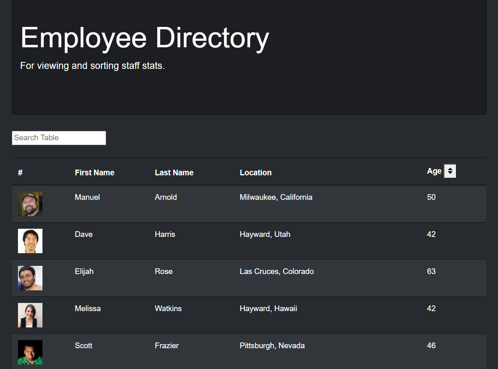
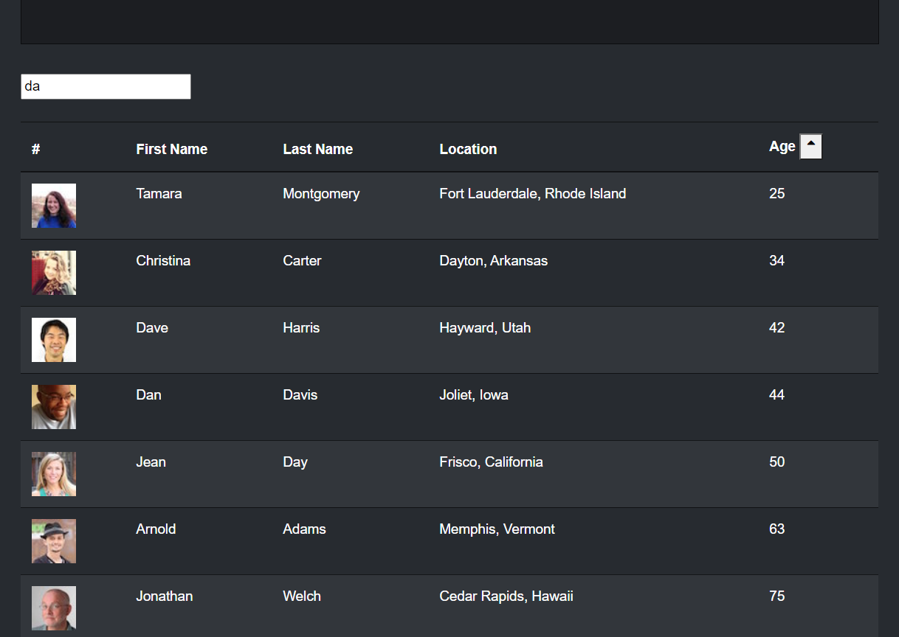

# Employee Directory

## Description

This React application is designed to allow a business to review information about their employee's and sort or search through that data. The styling was done primarily through Bootstrap and Bootswatch and the empoyee information comes from the [Random User API](https://randomuser.me/). Axios was used to incorporate the API into the code. The sorting method was adapted from [Florin Pops tutorial](https://www.florin-pop.com/blog/2019/07/sort-table-data-with-react/), and the search function was adapted from a [Medium article by Bhavya Ambasta](https://medium.com/crobyer/search-filter-with-react-js-88986c644ed5).

## Table of Contents

* [Link](#Link)

* [Screenshot](#Screenshot)

* [License](#license)

* [Contributing](#contributing)

* [Questions](#questions)

## Link

[This link will take you to the deployed site on Heroku!](https://joey-sisk.github.io/employee-directory/)

## Screenshot

## License

- MIT

- https://opensource.org/licenses/MIT
  
## Contributing

This would not have been possible without the help of my tutor Kumar Ramanathan, my instructor Calvin Carter, all of the class TA's including Sean Belverstone, Daniel Vega, and Fernando Medina, Elizabeth H. and my many fellow UT Bootcamp students.

## Questions

If you have any questions about the app, open an issue or contact me through the contact form on my portfolio website: https://joey-sisk.github.io/Portfolio/. You can find more of my work at [Joey Sisk](github.com/joey-sisk).
